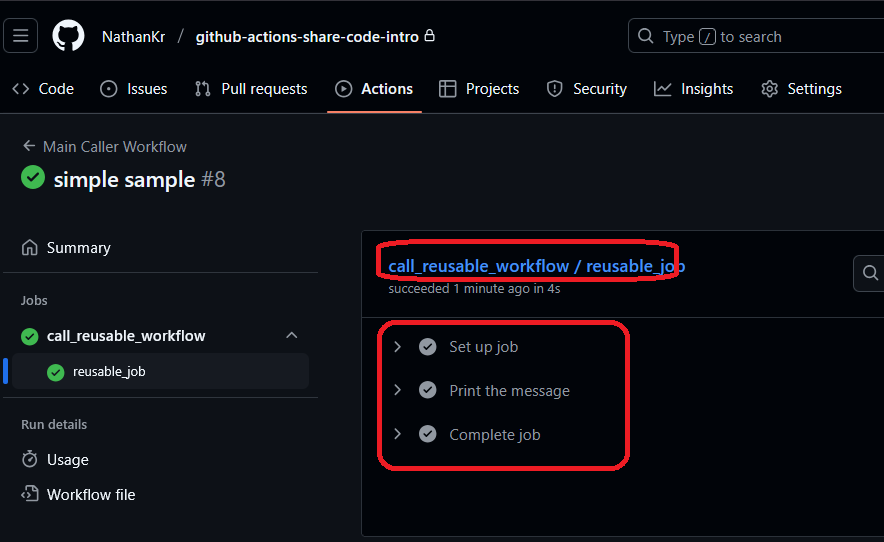

<h1>Project Name</h1>
Simple Code Sharing Sample with GitHub Actions


<h2>Project Description</h2>
This project provides a simple, practical example of how to share and reuse code between GitHub Actions workflows, especially within a monorepo structure. It demonstrates the use of <code>workflow_call</code> to create reusable workflows, promoting modularity and reducing code duplication in your CI/CD pipelines. This example includes a caller workflow that initiates a reusable workflow and a callee workflow that encapsulates shared logic.

<h2>My Motivation</h2>
I manage a monorepo for 'post2video' services, which includes a web server (Next.js) and a BullMQ worker. Each service currently has its own GitHub Actions workflow, but approximately 90% of the workflow code is identical. My motivation for this project is to demonstrate an effective way to share this common code

<h2>Installation</h2>
<p>To examine the sample workflows and code structure:</p>
<ol>
    <li>
        <strong>Clone the repository:</strong>
        <pre><code>git clone &lt;repository_url&gt;
cd &lt;repository_name&gt;</code></pre>
        <p>Replace <code>&lt;repository_url&gt;</code> with the actual URL of your GitHub repository.<br>Replace <code>&lt;repository_name&gt;</code> with the name of the directory that was created when you cloned the repository.</p>
    </li>
    <li>
        <p>Once cloned, you can explore the workflow definitions in the <code>.github/workflows/</code> directory.</p>
    </li>
</ol>


<h2>Usage</h2>

<p>To see the shared workflow in action:</p>

<ol>
  <li>
    <p><strong>Push to <code>main</code> branch:</strong> The <code>main-caller.yml</code> workflow is configured to automatically run when changes are pushed to the <code>main</code> branch of this repository.</p>
  </li>
  <li>
    <p><strong>Manual Trigger:</strong> Alternatively, you can manually trigger the <code>Main Caller Workflow</code> from the GitHub Actions tab in your repository. Look for the "Run workflow" dropdown on the workflow's page.</p>
  </li>
</ol>
<p>After triggering, observe the workflow run details to see the <code>simple-reusable.yml</code> workflow being called and executed.</p>

<h2>Technologies Used</h2>
<ul>
    <li>GitHub Actions</li>
</ul>

<h2>Design Options for Code Reuse</h2>
<ul>
  <li><strong><code>workflow_call</code></strong> – Best for sharing workflow logic in monorepos.</li>
  <li><strong>Composite Actions</strong> – Great for bundling multiple shell steps into a reusable unit.</li>
  <li><strong>Docker Actions</strong> – Useful when you need a consistent environment.</li>
  <li><strong>Shell Scripts</strong> – Good for portability but harder to test and maintain at scale.</li>
</ul>


For monorepos, <code>workflow_call</code> is generally the best choice for sharing complex workflow logic

<h2>workflow_call Basics</h2>
<p><code>workflow_call</code> is a powerful feature in GitHub Actions that allows you to create <strong>reusable workflows</strong>. These workflows can be invoked by other workflows, helping you avoid code duplication and maintain cleaner, more modular CI/CD pipelines, especially in monorepos. To understand how they work, let's look at the key components involved:</p>


<h3>Players</h3>
<ul>
  <li><strong>Caller:</strong> The workflow that triggers and passes inputs to the reusable workflow.</li>
  <li><strong>Callee:</strong> The reusable workflow that contains shared logic and executes when called.</li>
</ul>


<h3>Caller vs Callee Rules</h3>
<ul>
 <li>
        <strong>For the Calling Workflow (the "caller" workflow, here, <code>main-caller.yml</code>):</strong>
        <ul>
            <li>You <strong>can</strong> have any standard event triggers (<code>on: push</code>, <code>on: pull_request</code>, <code>on: schedule</code>, etc.) or <code>on: workflow_dispatch</code>.</li>
            <li>This workflow then uses the <code>uses:</code> keyword to call the reusable workflow.</li>
        </ul>
    </li>
    <li>
        <strong>For the Reusable Workflow (the "callee" workflow, here, <code>simple-reusable.yml</code>):</strong>
        <ul>
            <li>You <strong>cannot</strong> have standard event triggers like <code>on: push</code>, <code>on: pull_request</code>, <code>on: schedule</code>, etc.</li>
            <li>You <strong>must</strong> have <code>on: workflow_call</code> (and optionally <code>on: workflow_dispatch</code> for manual testing).</li>
        </ul>
    </li>
</ul>

<h3>Workflow Call Elements</h3>
<ul>
    <li><strong>Inputs:</strong> Variables defined in a reusable workflow that allow the calling workflow to pass data into it.</li>
    <li><strong>Outputs:</strong> Data generated by a reusable workflow that can be passed back and used by the calling workflow.</li>
    <li><strong>Secrets:</strong> Sensitive information (like API tokens) that can be securely passed from the calling workflow to the reusable workflow.</li>
    <li><strong>Permissions:</strong> Explicit grants of access rights (e.g., to read repository contents or write to packages) required by a workflow to perform its tasks.</li>
</ul>

<h2>Code Structure</h2>

This example demonstrates a fundamental concept in GitHub Actions: reusable workflows. This pattern promotes modularity, reduces duplication, and makes your CI/CD pipelines more manageable, especially for larger projects.

<h3>Caller workflow</h3>
This is the main workflow that initiates or "calls" another workflow. It's often where you define the triggers and top-level jobs for your CI/CD process.

```yml
name: Main Caller Workflow # The name of this workflow, displayed in GitHub's UI.

on:
  push: # This workflow will trigger automatically when code is pushed to the 'main' branch.
    branches:
      - main
  workflow_dispatch: # Allows you to manually trigger this workflow from the GitHub UI.

jobs:
  call_reusable_workflow: # Defines a job within this workflow.
    uses: ./.github/workflows/simple-reusable.yml # This is the crucial part. It calls the reusable workflow located at the specified path.
    with: # This section allows you to pass inputs to the reusable workflow.
      message: "Hello from the main workflow!" # Here, we're passing a string value to the 'message' input of the callee workflow.
```


<h3>Callee workflow</h3>
This is the workflow designed to be called and reused by other workflows. It encapsulates a specific set of actions or logic that can be consistently applied across different parts of your CI/CD pipeline.

```yml
# name: Simple Reusable Workflow # The name of this reusable workflow.

on:
  workflow_call: # This is the key trigger for a reusable workflow. It means this workflow can only be triggered by another workflow.
    inputs: # Defines the inputs that this reusable workflow expects from its caller.
      message: # The name of the input. This must match the key used in the 'with' section of the caller.
        required: true # Specifies that this input must always be provided by the caller.
        type: string # Defines the data type of the input.
        description: "A message passed from the caller workflow." # A helpful description for anyone using this reusable workflow.

jobs:
  reusable_job: # Defines a job within this reusable workflow.
    runs-on: ubuntu-latest # Specifies the operating system environment for this job.
    steps: # A sequence of tasks to be executed within the job.
      - name: Print the message # A descriptive name for this step.
        run: | # Executes a shell command.
          echo "Message from caller: ${{ inputs.message }}" # Accesses the 'message' input passed from the caller using the `inputs` context.
```

<h2>Demo</h2>
<p>This image shows the GitHub Actions UI after a push to the main branch, demonstrating the Main Caller Workflow triggering the Simple Reusable Workflow.</p>




<ul>
  <li><a href="https://docs.github.com/en/actions/sharing-automations/reusing-workflows">Official GitHub Actions Docs: Reusing Workflows</a></li>
  <li><a href="https://www.youtube.com/watch?v=x239z6DdE0A">Introduction to GitHub Actions (YouTube)</a></li>
</ul>


